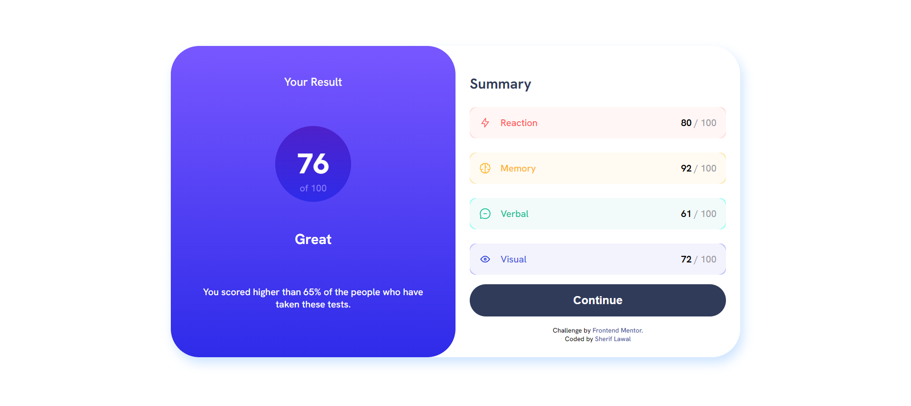

# Frontend Mentor - Results summary component solution

This is a solution to the [Results summary component challenge on Frontend Mentor](https://www.frontendmentor.io/challenges/results-summary-component-CE_K6s0maV). Frontend Mentor challenges help you improve your coding skills by building realistic projects. 

## Table of contents

- [Overview](#overview)
  - [The challenge](#the-challenge)
  - [Screenshot](#screenshot)
  - [Links](#links)
- [My process](#my-process)
  - [Built with](#built-with)
  - [What I learned](#what-i-learned)
  - [Continued development](#continued-development)
  - [Useful resources](#useful-resources)
- [Author](#author)
- [Acknowledgments](#acknowledgments)

## Overview

### The challenge

Users should be able to:

- View the optimal layout for the interface depending on their device's screen size
- See hover and focus states for all interactive elements on the page

### Screenshot

Add a screenshot of your solution. The easiest way to do this is to use Firefox to view your project, right-click the page and select "Take a Screenshot". You can choose either a full-height screenshot or a cropped one based on how long the page is. If it's very long, it might be best to crop it.

Alternatively, you can use a tool like [FireShot](https://getfireshot.com/) to take the screenshot. FireShot has a free option, so you don't need to purchase it. 

Then crop/optimize/edit your image however you like, add it to your project, and update the file path in the image above.

**Note: Delete this note and the paragraphs above when you add your screenshot. If you prefer not to add a screenshot, feel free to remove this entire section.**

### Links

- Solution URL: [That is the link to my github repo](https://github.com/lawal-sherif-itunu/result-summary.git)
- Live Site URL: [That is the live site URL](https://lawal-sherif-itunu.github.io/result-summary/)

## My process

### Built with

- Semantic HTML5 markup
- CSS custom properties
- Flexbox
- CSS Grid
- Mobile-first workflow

### What I learned

I learnt and revised how to grid and flex. 

### Continued development

CSS for now

### Useful resources

- [Kevin grid tutorial](https://www.youtube.com/watch?v=rg7Fvvl3taU) - This helped me for learning grid.

## Author

- Website - [Lawal Sherif](https://github.com/lawal-sherif-itunu)
- Frontend Mentor - [@lawal2000e](https://www.frontendmentor.io/profile/lawal2000)
- Twitter - [@SherifLawal12](https://twitter.com/SherifLawal12)

## Acknowledgments

Big thanks to my frontend team for always checking up on me that I am consistent. Also big thanks to BlockchainOAU (Nonse in particular). Also I want to use this medium to appreciate my ever supportive boss at web3schools.